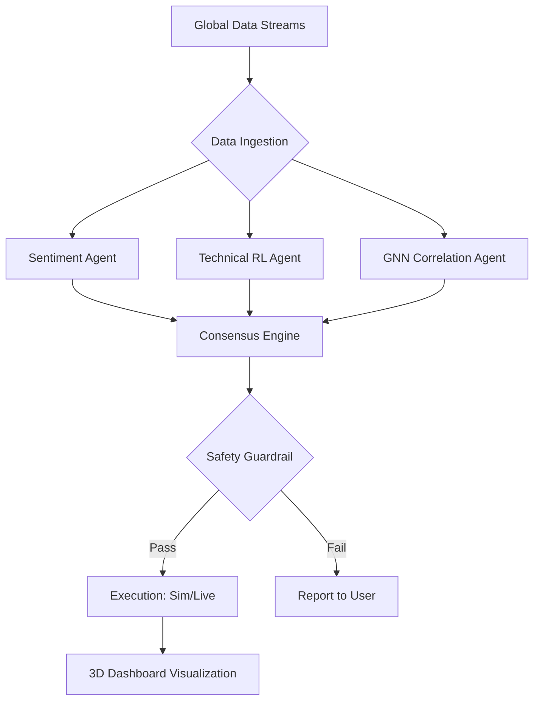

This `README.md` is designed to be a high-level project repository for **TradeMind AI**. It incorporates your background in **Agentic AI**, **3D Visualization**, and **Safety Systems** to create a professional, complex, and novel presentation.

---

#  Adversarial-Trade-Council: The Sim-to-Real Bridge

**TradeMind AI** is a high-fidelity, agentic trading ecosystem designed to bridge the gap between market theory and real-world execution. By combining **Reinforcement Learning (RL)**, **Multi-Agent Swarms**, and **3D Spatial Data Visualization**, TradeMind transforms the "Black Box" of algorithmic trading into an interactive, explainable, and educational experience.

---

##  The Vision
Most trading bots fail because they lack transparency and safety. TradeMind AI introduces an **Aviation-Grade Safety Stack** and **Explainable AI (XAI)** to ensure users don't just trade, but *understand* the underlying market mechanics.

---

##  Key Features

### 1. The "Sim-to-Real" Pipeline
* **Hyper-Realistic Simulation:** Backtest strategies on 10+ years of historical "Tick" data.
* **The Bridge:** Seamlessly transition from a 3D simulation environment to live **Paper Trading** via the Alpaca/Binance API.
* **Latency Emulation:** Simulates real-world "slippage" and network delays so users are prepared for live market friction.

### 2. Multi-Agent Swarm Intelligence
The platform utilizes a **Council of Specialists** rather than a single model:
* **The Macro Agent:** Parses global news and Fed speeches using LLM-based sentiment analysis.
* **The Graph Agent:** Uses **Graph Neural Networks (GNN)** to detect "Market Contagion" across correlated assets (e.g., how a drop in $NVDA$ affects the tech sector).
* **The Devil's Advocate:** An adversarial agent designed specifically to find flaws in the proposed trades.

### 3. Explainable AI (XAI) & 3D HUD
* **Narrative Reasoning:** Powered by **Gemini 1.5 Pro**, the agent provides real-time "Thought Logs," explaining its logic in natural language.
* **3D Market Landscape:** Built with **Three.js**, visualizing the Limit Order Book as a 3D terrain where liquidity is "elevation" and volatility is "weather."

### 4. Aviation-Grade Safety Stack
* **Triple-Modular Redundancy (TMR):** A trade only executes if the Strategist, Risk Auditor, and Sentiment Analyst reach a consensus.
* **Dynamic Kill-Switches:** Automated circuit breakers based on daily drawdown limits and "Black Swan" detection.

---

##  Tech Stack

| Layer | Technology |
| :--- | :--- |
| **Frontend** | React.js, Three.js (3D visualization), Framer Motion |
| **Brain** | Python, Stable-Baselines3 (RL), PyTorch |
| **Agent Orchestration** | LangChain / CrewAI (Agentic Frameworks) |
| **Intelligence** | Gemini API (Reasoning), Custom GNNs (Correlation) |
| **Backend** | FastAPI, Supabase (Auth & Database) |
| **Infrastructure** | Docker, WebSocket (Real-time data) |

---

##  System Architecture



---

##  Roadmap

- [ ] **Phase 1: The Sandbox** - Core RL environment with historical CSV data.
- [ ] **Phase 2: The HUD** - Three.js visualization of the order book and agent "neurons."
- [ ] **Phase 3: The Council** - Integration of the Multi-Agent voting protocol and LLM reasoning.
- [ ] **Phase 4: The Bridge** - Live API integration with Alpaca for Paper/Live trading.

---

##  Installation

1. **Clone the Repo**
   ```bash
   git clone https://github.com/your-username/TradeMind-AI.git
   ```
2. **Setup Environment**
   ```bash
   python -m venv venv
   source venv/bin/activate
   pip install -r requirements.txt
   ```
3. **Run the Dashboard**
   ```bash
   cd client && npm install && npm run dev
   ```

---

##  Disclaimer
*This software is for educational purposes only. Algorithmic trading involves significant risk. Never trade capital you cannot afford to lose.*

---
